# 07-4. 세 대·네 대·여덟 대

상태: 리서치 기반 초안

Spark 수가 늘어날수록 모델 크기보다 topology와 sharding 제약이 먼저 커진다. 세 대가 네 대보다 항상 빠른 것은 아니며, 여덟 대가 개인용 서버 여덟 대의 성능을 그대로 내는 것도 아니다.

## 3분 이해 (ELI5)

노드를 늘리면 사람 수만 늘어나는 것이 아니라 길과 규칙도 늘어난다.

```text
3대: 분담 규칙 확인
4대: 스위치·RDMA 경로 확인
8대: 전력·냉각·장애 격리까지 운영
```

모델을 나누는 방식이 장비 수와 맞지 않으면 사람이 늘어도 일이 빨라지지 않는다.



## 9.1 노드 수별 성격

| 노드 | 가장 현실적인 변화 | 기본 질문 |
|---:|---|---|
| 3 | PP/DP·모델 전용 patch·ring/mesh | TP=3이 정말 지원되는가? |
| 4 | switch/RDMA 기반 TP=4 | 하나의 대형 모델인가, 독립 서비스인가? |
| 6 | TP·PP·DP 조합과 스위치 운영 | 모델이 이 topology를 공식/커뮤니티로 검증했는가? |
| 8 | 랙형 클러스터·전력·냉각·장애 격리 | 속도보다 운영 비용을 감당할 수 있는가? |

## 9.2 세 대: TP=3을 기본값으로 두지 않는다

많은 모델의 attention head, KV head, MoE expert, MTP 구조는 3으로 깔끔하게 나누어지지 않는다. 따라서 `tensor-parallel-size=3`을 입력할 수 있다는 사실만으로 TP=3이 효율적이라고 결론 내리지 않는다.

세 대의 일반적인 선택은 다음과 같다.

| 방식 | 장점 | 단점 |
|---|---|---|
| PP=3 | 한 노드에 안 들어가는 모델을 적재 | pipeline bubble과 stage imbalance |
| DP=3 | 동시 사용자·장애 격리 | 모델 크기는 한 노드 기준 그대로 |
| 2+1 | DeepSeek TP=2와 worker 한 대 분리 | 모델 endpoint·라우팅을 운영해야 함 |
| model-specific TP=3 | 특정 recipe에서만 가능 | padding·patch·통신·품질을 별도 검증 |

[eugr의 3-node 문서](https://github.com/eugr/spark-vllm-docker/blob/main/README.md#support-for-3-node-mesh-setups)는 TP=3보다 PP=3 또는 DP=3을 중심으로 설명한다. 반면 MiMo V2.5 Omni처럼 virtual-head padding과 MTP 수정으로 TP=3을 시도한 사례도 있다. 이런 구성은 모델 전용 실험으로 보고 별도 검증이 필요하다. [MiMo V2.5 3대 사례](https://forums.developer.nvidia.com/t/mimo-v2-5-omni-on-3x-dgx-spark-tp-3-mtp-1m-context-39-tok-s/373948)

## 9.3 세 대 네트워크

NVIDIA의 3-Spark ring 플레이북은 Node1–Node2, Node2–Node3, Node3–Node1을 연결하는 구성을 설명한다. 커뮤니티 mesh 구성에서는 공통 Ethernet을 NCCL OOB와 관리 경로로 함께 요구할 수 있다.

```text
QSFP ring:  N1 ─── N2
             ╲     ╱
               N3

관리/OOB: 모든 노드가 동일한 Ethernet 또는 관리망에 연결
```

참고: [NVIDIA connect-three-sparks](https://github.com/NVIDIA/dgx-spark-playbooks/tree/main/nvidia/connect-three-sparks), [3-node mesh 설명](https://forums.developer.nvidia.com/t/three-node-spark-clusters-without-a-switch-are-now-supported-in-spark-vllm-docker-and-sparkrun/365296)

링크 수립, NCCL communicator, all-reduce, 모델 요청을 각각 검사한다. ring 케이블을 모두 연결했더라도 한 포트가 socket fallback으로 동작하면 측정값이 예상보다 크게 낮아질 수 있다.

## 9.4 네 대: TP=4의 첫 번째 깔끔한 확장점

네 대는 attention/head 구조와 병렬화 단위가 4로 맞는 모델에서 이해하기 쉬운 확장점이다. 보통 QSFP 스위치와 RDMA를 사용하며, 모든 노드의 driver, container, NCCL, 모델 파일을 같은 상태로 맞춘다.

공개 Qwen3.5-397B INT4-AutoRound TP=4 레시피는 다음과 같은 대표 수치를 보고한다.

- single-user 약 36–37 tok/s
- c4 aggregate 약 80–94 tok/s, peak 121 tok/s 보고
- 32K context·FP8 KV 조건
- Marlin TP=4 patch와 driver/kernel 조건

이 수치를 Qwen3.5-397B의 모든 quant와 engine에 적용할 수는 없다. [Qwen3.5-397B 4대 레시피](https://github.com/eugr/spark-vllm-docker/blob/main/recipes/4x-spark-cluster/qwen3.5-397b-int4-autoround.yaml)

NVIDIA 공식 multi-Spark vLLM 경로는 4대에서 MiniMax M2.5 TP=4와 129K context를 실행하는 예시를 제공한다. 이 예시는 해당 구성이 가능하다는 기준으로 삼고, 실제 workload의 quality와 soak 결과는 별도로 측정한다. [NVIDIA multi-Spark vLLM](https://github.com/NVIDIA/dgx-spark-playbooks/blob/main/nvidia/vllm/README.md#run-on-multiple-sparks-through-a-switch)

## 9.5 네 대에서 DeepSeek·GLM·Nemotron을 읽는 법

포럼에는 4대 DeepSeek TP=4에서 single 약 49.4 tok/s와 c8 aggregate 180 tok/s를 기록한 사례가 있다. 4대 GLM-4.7 SGLang/EAGLE에서는 20–27 tok/s를, Nemotron 3 Super에서는 MTP accept_len을 조정해 single-stream을 1.70배 개선한 결과를 보고했다.

이 수치들은 다음 조건을 포함한다.

- vLLM fork 또는 SGLang dev build
- 200G RoCE/RDMA
- FP8/NVFP4 KV와 model-specific patch
- NCCL 버전 pin
- shared-memory·CUDA graph·MTP 조정

따라서 노드 수만 보고 `4대니까 4배`라고 계산하지 않는다. [DeepSeek TP=4 recipe](https://forums.developer.nvidia.com/t/deepseek-v4-flash-on-4x-dgx-spark-via-vllm-jasl-fork-tp-4-rdma-mtp-49-54-tok-s-single-stream-full-recipe-the-traps/373808), [GLM-4.7 RDMA 사례](https://forums.developer.nvidia.com/t/glm-4-7-fp8-on-4x-dgx-spark-via-sglang-2-5x-speedup-8-2-25-tok-s-just-by-enabling-rdma/373675)

## 9.6 여섯·여덟 대: 클러스터 운영으로 넘어간다

6~8대에서는 모델을 실행하는 일보다 다음 운영 항목이 더 중요해진다.

- switch port·breakout cable·MTU·firmware 관리
- 노드별 power·temperature·fan·memory 모니터링
- 장애 노드 격리와 재시작 순서
- rank·hostfile·container image 일치
- storage에서 모델을 배포하는 방식
- aggregate throughput과 사용자별 latency의 우선순위

8× GB10에서 Nemotron 계열 TP=8과 100G/200G 네트워크를 비교한 사용기가 있다. 다만 이 결과를 개인용 Spark를 구매했을 때의 예상 성능으로 사용하지 않는다. [8× Spark cluster 사례](https://forums.developer.nvidia.com/t/8x-dgx-spark-cluster-build-report-crs812-400dd-4x100g-breakouts-nemotron-3-ultra-at-tp-8/373146)

## 9.7 TP·PP·DP 의사결정표

| 질문 | 권장 방향 |
|---|---|
| 모델이 한 노드에 들어가는가? | DP로 독립 endpoint를 우선 검토 |
| 한 노드에 안 들어가는가? | TP 또는 PP, 공식/recipe topology 확인 |
| single-stream latency가 핵심인가? | TP 통신과 PP bubble을 함께 측정 |
| 사용자 수가 많은가? | DP 또는 c4/c8 aggregate 측정 |
| 3대뿐인가? | PP=3·DP=3·2+1을 TP=3보다 먼저 비교 |
| 4대 이상인가? | switch/RDMA health 후 TP=4 레시피 검토 |
| 8대인가? | 모델보다 장애·전력·냉각·관측 설계를 먼저 완성 |

## 9.8 확장 벤치마크

노드를 추가할 때는 다음 항목을 같은 benchmark schema로 기록한다.

```text
node_count: 1 / 2 / 3 / 4 / 8
topology: direct / ring / switch
parallelism: TP / PP / DP
network_path: IB/RDMA / Socket
model_revision:
quant:
kv_dtype:
context:
concurrency: c1 / c4 / c8
single_stream_decode:
aggregate_decode:
ttft_p50:
memory_peak_per_node:
temperature_peak_per_node:
error_rate:
```

노드를 늘려도 single-stream 성능은 그대로이고 aggregate만 늘 수 있다. 반대로 aggregate가 늘어도 사용자별 TTFT는 나빠질 수 있다. 따라서 두 결과를 항상 함께 보여준다.

## 이 장의 검증 체크리스트

- [ ] 3대에서 TP=3을 당연한 기본값으로 두지 않았다.
- [ ] PP·DP·2+1·model-specific TP를 비교했다.
- [ ] 4대 switch/RDMA 경로를 모델 실행 전에 검증했다.
- [ ] single-stream과 c4/c8 aggregate를 나누었다.
- [ ] topology·NCCL transport·driver·container digest를 기록했다.
- [ ] 6~8대 성능을 1대/2대 숫자로 추정하지 않았다.
- [ ] 전력·냉각·장애 격리를 benchmark 결과에 포함했다.

## 아직 모르는 것

- 같은 model·prompt·quant에서 3대 PP와 4대 TP의 실제 효율 차이
- 8대에서 network oversubscription과 model parallel scaling
- DP 서비스 분리와 TP 단일 모델의 agent 성공률 차이
- 장시간 장애 후 rank 재구성 자동화 수준
