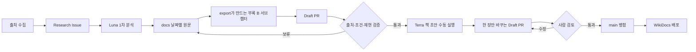
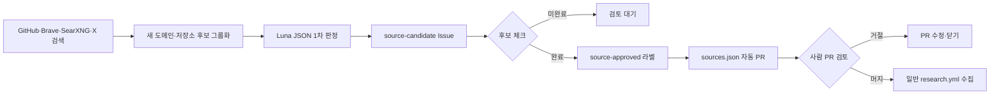

# DGX Spark 리서치 자동화

이 저장소의 리서치 자동화는 수동 Issue와 예약 검색을 하나의 흐름으로 합칩니다. 검색과 중복 제거는 일반 스크립트가 맡고, 새 후보가 있을 때만 Copilot CLI를 부릅니다. 자동 분석은 책의 최종 원고가 아니라 사람이 검토할 1차 초안입니다.

```text
수동 Issue 또는 예약 수집
        ↓  새 후보가 없으면 종료
후보 Issue
        ↓
Luna 1차 분석 (Free는 auto)
        ↓
날짜별 보고서 draft PR
        ↓  사람 검토·병합
Terra 책 초안 (필요할 때 수동 실행)
        ↓  사람 검토, 필요하면 Sol 최종 검토
main 병합 → WikiDocs 배포
```

운영자용 전체 흐름은 [SVG flow artifact](research-promotion-flow.svg)에서도 확인할 수 있습니다.



새 출처 후보 찾기는 일반 리서치 수집과 별도의 예약 Workflow로 실행합니다.



## 검색 대상

기본 자격 증명으로 접근할 수 있는 대상은 GitHub API와 RSS다.

- NVIDIA DGX Spark 공식 문서와 사용자 가이드
- NVIDIA Developer Forum의 DGX Spark / GB10 카테고리
- DGX Spark 관련 GitHub release·issue·검색 결과
- Hugging Face 모델·토론 링크가 포함된 검색 결과
- Reddit의 LocalLLaMA·LocalAIServers 검색 RSS
- Arca와 서버포럼(`svrforum.com`)의 도메인 제한 검색
- DGX Spark 설치·초기 설정, 복구·부팅, Docker·CUDA 오류, 성능 저하·발열·전원, 네트워크·RDMA 관련 문서와 경험담
- 등록된 실행 절차와 커뮤니티 저장소

선택적으로 Secret을 등록하면 검색 범위를 넓힐 수 있습니다.

- `BRAVE_SEARCH_API_KEY`: NVIDIA·Arca·블로그·국내 커뮤니티를 도메인 제한 검색
- `X_BEARER_TOKEN`: X 최근 검색

## 새 출처 후보 찾기

[`research-source-discovery.yml`](../.github/workflows/research-source-discovery.yml)는 매주 월요일 11:31 KST에 기존 출처 목록에 없는 후보를 찾습니다. 평일 자동 리서치와 유료 세션이 겹치지 않도록 한 시간 넘게 간격을 뒀습니다. 이 Workflow는 후보를 검토용 `source-candidate` Issue로 만듭니다. 후보 승인과 `sources.json` 반영은 별도의 `Promote Approved Research Sources` Workflow가 담당합니다.

후보 목록은 다음 경로의 결과를 합쳐 만듭니다.

- GitHub Repository Search: DGX Spark·GB10·DeepSeek·Qwen·MiniMax 관련 새 저장소
- Brave Search: 도메인 제한 없이 최근 웹 결과를 검색해 기존 목록에 없는 호스트 추출
- 선택한 검색 백엔드: 지정한 주소 목록 또는 `searx.space` 최신 목록에서 한 번에 한 인스턴스씩 JSON API 검색
- 선택 X API: 게시물에 포함된 외부 링크만 추출하고 X 자체 주소는 출처 후보로 등록하지 않음

수집기는 URL을 정규화한 뒤 이미 등록된 도메인·저장소와 이전 `source-candidate` Issue에 나온 후보를 제외합니다. 같은 도메인에 여러 근거 링크가 있으면 하나의 후보로 묶어 `evidence_count`와 근거 링크를 Issue에 남깁니다.

Copilot CLI가 설정되어 있으면 선택된 모델이 후보의 메타데이터만 읽고 정해진 JSON 형식으로 1차 분류합니다. 권장 모델은 Luna이며, Free 플랜에서는 `auto`가 대신 선택합니다. 추가 웹 탐색은 하지 않으며, 사유는 한 문장, 사람 확인 항목은 최대 세 개로 제한합니다. `keep`은 자동 승인이나 즉시 등록이 아니라 사람이 먼저 확인할 후보라는 뜻입니다. Copilot 토큰이 없거나 JSON 검증에 실패해도 원시 후보 Issue는 생성되므로 수집 결과를 잃지 않습니다.

### 후보 승인과 sources.json 반영

후보 Issue에서 실제로 사용할 후보를 모두 `반영 승인`으로 체크한 뒤 `source-approved` 라벨을 추가하면 `promote-source-candidates.yml`이 실행됩니다. 이때 `source-candidate` 라벨은 그대로 둡니다. 저장소 쓰기 권한이 있는 사용자의 변경만 처리하며, `main`을 직접 수정하지 않고 다음과 같은 자동 PR을 만듭니다.

- GitHub 저장소 후보 → `github_repositories`
- RSS 후보 → `rss`
- 웹 도메인 후보 → 일반 DGX Spark 웹 검색의 `domains`
- 그 밖의 승인 URL → `approved_sources`

같은 후보가 이미 등록되어 있으면 중복으로 추가하지 않습니다. 자동 PR은 출처 주소와 등록 유형을 사람이 확인한 뒤 머지해야 하며, PR이 머지되기 전에는 일반 리서치 수집에 사용하지 않습니다. `approved_sources`에 등록된 단일 URL은 다음 일반 리서치 실행에서 직접 읽어 날짜별 리서치 후보로 만듭니다. 관련 PR을 머지하면 완료 Workflow가 원본 Issue의 `source-candidate`와 `source-approved` 라벨을 `source-promoted`로 자동 변경합니다. 일부 후보가 남아 있으면 `source-approved` 라벨을 추가하지 않습니다.

### 검색 엔드포인트 갱신과 캐시

검색 주소 최신화와 새 출처 후보 찾기는 서로 다른 주기로 실행합니다. [`refresh-search-endpoints.yml`](../.github/workflows/refresh-search-endpoints.yml)는 평일 10:05 KST마다 `searx.space/data/instances.json`의 전체 목록을 읽습니다. HTTPS·정상 상태·목록의 품질 정보를 이용해 후보를 고른 뒤, 실제 `/search?q=DGX+Spark&format=json` 요청에서 JSON `results` 배열이 정상 반환된 주소만 최대 5개 저장합니다. 결과가 0건이어도 API 응답 형식이 정상이라면 endpoint 자체는 사용 가능으로 기록하고, 실제 후보 수집 통계에서는 0건으로 구분합니다.

검증 결과는 [`research/search-endpoints.json`](../research/search-endpoints.json)에 `last-known-good`(마지막으로 정상 확인된 주소) 캐시로 기록합니다. 주소 목록이 바뀔 때만 `automation/search-endpoints` 브랜치의 PR을 갱신하므로 매일 불필요한 PR이 생기지 않습니다. PR 본문에는 이번에 반영될 주소 목록, 전체 후보 수, 실제 검사 수를 함께 표시합니다. `main`에 병합하기 전에는 변경된 목록이 리서치 실행에 반영되지 않습니다.

목록 조회가 실패하거나 공개 인스턴스가 HTML·403·429·타임아웃을 반환하면 기존 캐시를 유지하고 다음 주소를 시도합니다. 캐시가 비어 있으면 검색 기능만 실패 처리하며 GitHub·RSS·Brave·X 수집은 계속합니다. 캐시에 남은 주소도 실제 요청으로 다시 확인하므로 `searx.space`에 올라 있다는 사실만으로 정상 주소로 간주하지 않습니다.

### SearXNG 사용 방식

검색 백엔드 API는 `/search?q=검색어&format=json` 형식입니다. Workflow는 `SEARCH_URLS`에 쉼표로 구분한 주소 목록이 있으면 그 목록을 우선 사용하고, `SEARCH_URL`은 단일 주소로 사용합니다. 명시적 주소가 설정된 실행은 그 주소만 검사하며, 실패해도 공개 캐시로 넘어가지 않습니다. 설정값이 없으면 `research/search-endpoints.json`의 `last-known-good` 주소를 먼저 사용하고, 캐시가 없을 때만 `searx.space/data/instances.json`의 HTTPS·정상 상태 인스턴스를 최대 3개까지 순서대로 시도합니다. 403·429·HTML·타임아웃이 발생한 인스턴스는 해당 실행에서 제외하고 다음 주소로 넘어갑니다. 새 출처 후보를 찾는 Workflow는 실행 직전에 최신 목록을 다시 검사하므로 주간 실행에서도 오래된 주소에 고정되지 않습니다.

공개 인스턴스는 JSON 포맷을 비활성화하거나 자동 요청을 제한할 수 있습니다. 미국 인스턴스만 쓰려면 `SEARCH_URLS`에 검증한 미국 주소 여러 개를 직접 넣습니다. 하나의 주소만 쓰려면 기존 `SEARCH_URL`을 사용합니다. 직접 운영하는 HTTPS 인스턴스가 가장 안정적입니다.

GitHub-hosted Runner에서 접근할 수 없는 Spark·집 안의 LAN 주소는 사용할 수 없습니다. 그런 경우에는 공개 HTTPS 주소, VPN으로 연결된 self-hosted Runner 또는 별도 VPS 인스턴스가 필요합니다. SearXNG가 실패해도 GitHub·RSS·Brave·X 수집은 독립적으로 계속됩니다.

검색 기능은 [SearXNG 공식 Search API 문서](https://docs.searxng.org/dev/search_api.html)와 [공식 Docker 설치 문서](https://docs.searxng.org/admin/installation-docker.html)의 API·배포 방식을 기준으로 합니다.

X·Arca·서버포럼은 접근 제한이나 검색 API 정책이 바뀔 수 있으므로, 접근되지 않은 자료를 성공한 리서치로 기록하지 않습니다. 원문 전체를 저장하지 않고 URL과 짧은 메타데이터만 Issue에 남깁니다.

## 실행 방식

- 평일 10:05 KST: 검색 인스턴스 전체 목록을 확인하고, 변경되었을 때 엔드포인트 캐시 PR을 갱신합니다.
- 평일 10:17 KST: `research/sources.json`의 GitHub·RSS·선택 API를 확인합니다.
- 매주 월요일 11:31 KST: 새 출처 후보를 찾기 직전에 검색 엔드포인트를 다시 검사합니다.
- 새 자료가 있으면 자동으로 Issue를 생성합니다.
- Issue 본문에는 수집 요약과 URL 색인을 두고, 제목·출처·짧은 요약을 포함한 전체 후보는 60KB 이하의 자동 생성 댓글로 나눕니다. URL 색인이 본문 크기 때문에 일부만 실리면 다음 수집이 자동 생성 댓글까지 확인해 중복을 제외합니다.
- `COPILOT_GITHUB_TOKEN`이 있고 새 후보가 있으면 같은 실행에서 선택한 모델로 분석합니다. 같은 Issue의 보고서나 열린 PR이 이미 있으면 모델을 부르지 않습니다.
- 수동 자료는 Issue를 만든 뒤 `research-ready` 라벨을 추가합니다.
- 분석 결과는 날짜별 상세 문서(`docs/research-issue-N_YYYY-MM-DD.md`)에만 기록하고 `research/issue-*` 브랜치의 draft PR을 생성합니다. 날짜별 WikiDocs 공개 서브챕터(`appendix-b-research-issue-N_YYYY-MM-DD.md`)와 `TOC.md` 항목은 `Publish WikiDocs` export가 `docs/` 원문에서 생성합니다.
- `book/appendix-b-research-log.md`는 고정된 부록 B 안내 페이지입니다. 자동 리서치는 이 파일에 날짜별 내용을 누적하지 않습니다.
- 날짜별 원문을 삭제하면 다음 `main` 배포에서 export 결과와 WikiDocs 배포 저장소의 대응 페이지도 함께 삭제됩니다. export가 실패하면 배포가 중단되므로 실수로 일부 페이지만 삭제되는 일을 막을 수 있습니다.
- 보고서의 후보 수는 Issue 본문과 자동 생성 후보 댓글에 실제로 기록된 번호 목록의 스냅샷입니다. 일반 댓글이나 Copilot 분석에 들어간 번호 목록은 세지 않습니다. 다음 수집에서 후보 수가 늘거나 줄면 새 Issue의 목록과 보고서 수치도 함께 바뀝니다.
- 날짜별 로그 외의 책 본문 승격은 검증 후 수동 `Draft a Reviewed Book Chapter` Workflow로 수행합니다. 실행할 때 날짜별 보고서 하나와 기존 책 파일 하나를 지정하며, 결과는 자동 병합되지 않는 draft PR입니다.
- `main`에 병합하기 전에는 `book/`이 배포되지 않습니다.

## 보고서 형식과 분석 모델의 경계

- 고정 형식은 [`templates/research-issue-report.md`](../templates/research-issue-report.md)가 정의합니다.
- Workflow가 날짜·Issue 번호·실행 모델을 먼저 채운 보고서 뼈대를 만듭니다.
- Issue 본문과 댓글을 합친 프롬프트는 Runner의 임시 파일에 저장합니다. Copilot CLI에는 이 파일을 읽으라는 짧은 지시만 전달하므로 후보가 많아져도 운영체제의 명령행 길이 제한에 걸리지 않습니다.
- Copilot 분석 뒤 [`tools/normalize_research_report.py`](../tools/normalize_research_report.py)가 제목과 메타데이터를 원본 Issue·실행 날짜·모델 기준으로 복원합니다. 모델이 메타데이터를 삭제하거나 바꿔도 형식 계약은 모델 출력에 의존하지 않습니다.
- Copilot CLI의 선택 모델은 출처 분석 내용만 채웁니다. 모델을 바꿔도 heading과 메타데이터 계약은 바뀌지 않습니다.
- [`tools/check_research_report.py`](../tools/check_research_report.py)가 파일명, 필수 heading, 메타데이터, URL, 미완성 placeholder를 검사합니다.
- 검증에 실패하면 draft PR을 만들지 않습니다. 따라서 LLM이 형식을 임의로 바꾸거나 `재현 필요` 항목을 `즉시 반영`으로 과장해도 자동 단계에서 중단됩니다.
- 한국어 문장 지침은 [`prompts/fluent-korean.md`](../prompts/fluent-korean.md)에 고정하고, 원본 기준은 [fluent-korean](https://github.com/snflkd/fluent-korean) commit `4e08ed6`로 기록합니다.

## 모델 역할과 호출 한도

모델 이름은 성능 서열이 아니라 작업 역할로 사용합니다. GitHub의 현재 분류에서 Luna는 가벼운 작업, Terra는 균형 잡힌 범용 작업, Sol은 강한 추론 작업에 해당합니다. 모델별 단가와 제공 범위는 바뀔 수 있으므로 [GitHub 모델·가격표](https://docs.github.com/en/copilot/reference/copilot-billing/models-and-pricing)를 기준으로 다시 확인합니다.

| 단계 | 권장 모델 | 하는 일 | 실행 조건 |
|---|---|---|---|
| 새 출처 판정 | Luna | 후보 메타데이터 분류 | 새 후보가 있을 때만 |
| 날짜별 리서치 | Terra | 원문 확인, 근거 충돌 분석, 보고서 작성 | 새 Issue이며 기존 보고서·PR이 없을 때만 |
| 책 본문 초안 | Terra | 검토된 보고서를 기존 장 한 편에 반영 | 사람이 보고서와 책 파일을 지정할 때만 |
| 최종 고난도 검토 | Sol | 충돌하는 근거, 구조 변경, 중요한 수치 검토 | Pro+ 이상에서만 수동 실행 |

Copilot Free는 모델을 직접 고르지 못하고 `auto`만 사용할 수 있으므로 기존 자동화도 `auto`로 계속 동작합니다. Copilot Pro에서는 Luna와 Terra를 선택할 수 있지만 Sol은 선택할 수 없습니다. Sol은 Pro+ 이상에서 제공합니다. 제공 모델은 바뀔 수 있으므로 [GitHub 지원 모델 표](https://docs.github.com/en/copilot/reference/ai-models/supported-models)를 함께 확인합니다.

`auto`도 유료 플랜에서 쓸 수 있고 [모델 비용을 10% 할인](https://docs.github.com/en/copilot/concepts/models/auto-model-selection#discount-for-using-auto-model-selection)받습니다. 다만 실행마다 선택 모델이 달라질 수 있습니다. 같은 리서치를 다시 비교하고 보고서 메타데이터에 모델을 남겨야 하는 이 저장소에서는 역할별 모델을 고정합니다. Copilot Pro에서는 다음 Repository variables를 사용합니다.

```text
SOURCE_DISCOVERY_MODEL=gpt-5.6-luna
RESEARCH_MODEL=gpt-5.6-terra
BOOK_DRAFT_MODEL=gpt-5.6-terra
```

### Copilot Pro 선택 모델과 AIC 단가

AIC는 호출 횟수가 아니라 토큰 사용량으로 계산합니다. GitHub의 현재 기준은 1 AIC가 0.01달러이며, 아래 값은 기본 컨텍스트에서 100만 토큰을 처리할 때의 `입력 / 캐시 입력 / 캐시 쓰기 / 출력` AIC입니다. `-`는 캐시 쓰기 단가가 따로 없다는 뜻입니다. 가격은 [GitHub 모델·가격표](https://docs.github.com/en/copilot/reference/copilot-billing/models-and-pricing)를 기준으로 합니다.

| 계열 | Copilot CLI 모델 ID | 입력 | 캐시 입력 | 캐시 쓰기 | 출력 |
|---|---|---:|---:|---:|---:|
| OpenAI | `gpt-5-mini` | 25 | 2.5 | - | 200 |
| OpenAI | `gpt-5.3-codex` | 175 | 17.5 | - | 1,400 |
| OpenAI | `gpt-5.4` | 250 | 25 | - | 1,500 |
| OpenAI | `gpt-5.4-mini` | 75 | 7.5 | - | 450 |
| OpenAI | `gpt-5.6-luna` | 20 | 2 | 25 | 120 |
| OpenAI | `gpt-5.6-terra` | 200 | 20 | 250 | 1,200 |
| Anthropic | `claude-haiku-4.5` | 100 | 10 | 125 | 500 |
| Anthropic | `claude-sonnet-4.5` | 300 | 30 | 375 | 1,500 |
| Anthropic | `claude-sonnet-4.6` | 300 | 30 | 375 | 1,500 |
| Anthropic | `claude-sonnet-5` | 200 | 20 | 250 | 1,000 |
| Google | `gemini-3.1-pro-preview` | 200 | 20 | - | 1,200 |
| Google | `gemini-3.5-flash` | 150 | 15 | - | 900 |
| Google | `gemini-3.6-flash` | 75 | 7.5 | - | 375 |
| Google | `gemini-3.7-flash` | 75 | 7.5 | - | 375 |
| Microsoft | `mai-code-1-flash` | 75 | 7.5 | - | 450 |
| Microsoft | `mai-code-1.1-flash` | 20 | 2 | - | 120 |
| xAI | `grok-4.5` | 200 | 50 | - | 600 |
| xAI | `grok-4.6` | 200 | 50 | - | 600 |
| Moonshot AI | `kimi-k2.7-code` | 95 | 19 | - | 400 |
| Moonshot AI | `kimi-k3` | 300 | 30 | - | 1,500 |

같은 작업을 맡겼을 때의 차이는 다음처럼 볼 수 있습니다. 비교용 작업 1회는 일반 입력 10만 토큰과 출력 1만 토큰을 처리하는 단일 모델 요청입니다. 캐시를 쓰지 않고 장문 컨텍스트 문턱을 넘지 않는다고 가정했습니다. 월간 횟수는 Copilot Pro의 1,500 AIC를 이 작업에만 썼을 때의 이론값이므로, 여러 차례 모델을 호출하는 실제 에이전트 실행 횟수와는 다릅니다.

| 계열 | 모델 ID | 비교용 작업 1회 | Luna 대비 | 월 1,500 AIC 기준 |
|---|---|---:|---:|---:|
| OpenAI | `gpt-5.6-luna` | 3.20 AIC | 1.00배 | 약 469회 |
| Microsoft | `mai-code-1.1-flash` | 3.20 AIC | 1.00배 | 약 469회 |
| OpenAI | `gpt-5-mini` | 4.50 AIC | 1.41배 | 약 333회 |
| Google | `gemini-3.6-flash` | 11.25 AIC | 3.52배 | 약 133회 |
| Google | `gemini-3.7-flash` | 11.25 AIC | 3.52배 | 약 133회 |
| OpenAI | `gpt-5.4-mini` | 12.00 AIC | 3.75배 | 약 125회 |
| Microsoft | `mai-code-1-flash` | 12.00 AIC | 3.75배 | 약 125회 |
| Moonshot AI | `kimi-k2.7-code` | 13.50 AIC | 4.22배 | 약 111회 |
| Anthropic | `claude-haiku-4.5` | 15.00 AIC | 4.69배 | 약 100회 |
| Google | `gemini-3.5-flash` | 24.00 AIC | 7.50배 | 약 63회 |
| xAI | `grok-4.5` | 26.00 AIC | 8.12배 | 약 58회 |
| xAI | `grok-4.6` | 26.00 AIC | 8.12배 | 약 58회 |
| Anthropic | `claude-sonnet-5` | 30.00 AIC | 9.38배 | 약 50회 |
| OpenAI | `gpt-5.3-codex` | 31.50 AIC | 9.84배 | 약 48회 |
| OpenAI | `gpt-5.6-terra` | 32.00 AIC | 10.00배 | 약 47회 |
| Google | `gemini-3.1-pro-preview` | 32.00 AIC | 10.00배 | 약 47회 |
| OpenAI | `gpt-5.4` | 40.00 AIC | 12.50배 | 약 38회 |
| Anthropic | `claude-sonnet-4.5` | 45.00 AIC | 14.06배 | 약 33회 |
| Anthropic | `claude-sonnet-4.6` | 45.00 AIC | 14.06배 | 약 33회 |
| Moonshot AI | `kimi-k3` | 45.00 AIC | 14.06배 | 약 33회 |

긴 컨텍스트에서는 다음 모델의 단가가 올라갑니다.

| 모델 ID | 적용 기준 | 입력 | 캐시 입력 | 캐시 쓰기 | 출력 |
|---|---|---:|---:|---:|---:|
| `gpt-5.4` | 272K 초과 | 500 | 50 | - | 2,250 |
| `gpt-5.6-luna` | 200K 초과 | 40 | 4 | 50 | 180 |
| `gpt-5.6-terra` | 272K 초과 | 400 | 40 | 500 | 1,800 |
| `gemini-3.1-pro-preview` | 200K 초과 | 400 | 40 | - | 1,800 |
| `grok-4.5`, `grok-4.6` | 200K 초과 | 400 | 100 | - | 1,200 |

실제 사용량은 `입력 토큰÷1,000,000×입력 단가`처럼 각 토큰 종류의 비용을 계산해 합산합니다. `auto`는 고정 단가가 없으며 실제로 선택된 모델의 비용에서 10% 할인됩니다. 같은 입력과 출력이라면 Luna는 Terra보다 훨씬 저렴하므로 대량 후보 선별에 쓰고, Terra는 근거 판단과 책 문장 작성에만 사용합니다.

[Pro의 월간 AI credit](https://docs.github.com/en/copilot/get-started/plans#github-ai-credits-allowance-by-plan)은 기본·flex allotment를 합쳐 1,500입니다. 후보 선별은 저렴한 Luna와 `low` effort를 사용하고, 근거 판단과 문장 작성은 Terra와 `medium` effort를 사용합니다. Sol이 필요한 검토를 자동 스케줄에 넣지 않는 이유도 월간 한도를 한 번의 고비용 실행에 쓰지 않기 위해서입니다.

현재 스케줄과 세션 상한으로 계산한 월간 최대 예산은 다음과 같습니다. 한 달의 평일은 최대 23일, 월요일은 최대 5회로 계산합니다.

| 작업 | 월 최대 실행 | 회당 soft cap | 월간 예산 |
|---|---:|---:|---:|
| 평일 날짜별 리서치 | 23회 | 30 AIC | 690 AIC |
| 주간 새 출처 판정 | 5회 | 30 AIC | 150 AIC |
| 자동 실행 합계 | 28회 | - | 840 AIC |

모든 예약 실행에서 새 후보가 나오는 보수적인 계산으로도 660 AIC가 남습니다. 책 초안은 회당 60 AIC이므로 산술상 최대 11회지만, Copilot Chat과 다른 CLI 작업도 같은 월간 한도를 씁니다. 개인 사용분 300 AIC 이상을 남기려면 책 초안은 월 5회 이내로 운영하는 편이 안전합니다. 후보가 없거나 중복 보고서·PR이 있으면 Workflow는 모델 호출을 건너뛰므로 실제 사용량은 이 계산보다 적을 수 있습니다. `--max-ai-credits`는 soft cap이므로 응답이 끝나는 시점에 소폭 넘을 가능성은 남아 있습니다.

Free 플랜에서 수동 책 초안까지 시험하려면 `BOOK_DRAFT_MODEL=auto`를 따로 등록해야 합니다. 이때 실제 편집 모델이 Terra라는 보장은 없습니다. 변수를 등록하지 않은 수동 책 초안 Workflow는 Terra를 명시적으로 요청하므로, 해당 모델을 선택할 수 없는 플랜에서는 실행이 실패합니다.

세 Workflow는 같은 concurrency group을 사용하므로 Copilot 세션이 동시에 실행되지 않습니다. 자동 출처 판정과 날짜별 리서치는 비용을 먼저 억제하기 위해 30 AIC에서 시작하고, 수동 책 초안은 기본 60 AIC의 soft cap을 둡니다. 이 상한은 모델 응답이 끝난 뒤 확인되므로 마지막 응답 때문에 조금 넘을 수 있습니다. GitHub는 일반적으로 30보다 큰 값을 권장하므로 30에서 작업이 자주 중단될 때만 상한을 올립니다. 이 기능은 공개 미리보기라 동작이 바뀔 수 있습니다. 자세한 내용은 [GitHub의 AI credit session limit 안내](https://docs.github.com/en/copilot/how-tos/copilot-cli/use-copilot-cli/set-session-limit)를 확인합니다.

CLI는 검증한 `1.0.80`으로 고정합니다. 자동 업데이트를 끄고, 오류 출력은 토큰 형태와 등록된 인증값을 지운 뒤 Actions 로그에만 짧게 남깁니다. Issue에는 원시 오류 출력을 게시하지 않습니다.

### 검토된 보고서로 책 초안 만들기

1. 날짜별 리서치 PR을 검토해 `main`에 병합합니다.
2. Actions에서 `Draft a Reviewed Book Chapter`를 실행합니다.
3. `research_report`에 `docs/research-issue-N_YYYY-MM-DD.md`, `book_file`에 보완할 기존 `book/*.md`를 입력합니다.
4. Terra가 웹을 새로 검색하지 않고 두 파일만 바탕으로 초안을 만듭니다.
5. Workflow가 지정한 책 파일 하나만 바뀌었는지, H1과 WikiDocs export가 유효한지 검사한 뒤 draft PR을 엽니다.
6. 사람이 원문 링크와 수치를 확인하고 수정·병합합니다. 판단이 어렵거나 장 전체 구조를 바꾸는 작업만 Sol로 따로 검토합니다.

같은 책 파일을 수정하는 draft PR이 열려 있으면 기본적으로 새 모델 호출을 건너뜁니다. Terra가 옮길 내용이 없다고 판단해 파일을 고치지 않으면 정상 종료하고 PR도 만들지 않습니다. 꼭 다시 실행해야 할 때만 `force`를 선택합니다.

## 필요한 설정

Repository Actions 설정:

- Settings → Actions → General → Workflow permissions에서 `Allow GitHub Actions to create and approve pull requests`를 활성화합니다.
- Workflow에도 `contents: write`와 `pull-requests: write`가 필요합니다. 이 설정이 꺼져 있으면 분석과 branch push는 성공하지만 draft PR 생성 단계에서 실패합니다.

Repository Actions Secret:

- `COPILOT_GITHUB_TOKEN`: Copilot CLI 인증 토큰

선택 Repository Actions Secrets:

- `BRAVE_SEARCH_API_KEY`: 일반 웹·Arca·국내 커뮤니티 검색

선택 Repository Secret/Variable:

- `SEARCH_URL`: JSON API가 활성화된 검색 인스턴스의 기본 HTTPS 주소입니다. 비공개 주소는 반드시 Secret으로 등록합니다.
- `SEARCH_URLS`: 여러 검색 기본 주소를 쉼표로 구분한 failover 목록입니다. 비공개 주소는 반드시 Secret으로 등록합니다.
- `SEARCH_API_KEY`: 검색 주소가 요구하는 API 키입니다. 요청에는 `Authorization: Bearer <키>` 헤더로만 전달합니다. 키를 URL이나 로그에 넣지 않습니다.
- `SEARCH_DIRECTORY_URL`: 공개 인스턴스 목록 JSON 주소를 바꿀 때 사용하는 선택 설정
- `SOURCE_DISCOVERY_MODEL`: 출처 후보를 검토할 때 사용할 Copilot 모델. 비워 두면 `RESEARCH_MODEL`, 그다음 `auto`를 사용
- `SOURCE_DISCOVERY_EFFORT`: 후보 판정 effort. 기본값 `low`
- `SOURCE_DISCOVERY_MAX_AI_CREDITS`: 출처 판정 세션의 AIC soft cap. 기본값 `30`, 허용 범위 `30~60`
- `X_BEARER_TOKEN`: X 최근 검색

Repository Variables:

- `RESEARCH_MODEL`: 기본값 `auto`이며, 계정에서 사용할 수 있는 모델을 Copilot이 선택합니다. 특정 모델을 강제하려면 Repository variable로 지정합니다. 계정·플랜에서 제공하지 않는 모델 ID를 지정하면 분석 단계가 실패합니다.
- `RESEARCH_EFFORT`: 기본값 `medium`
- `RESEARCH_MAX_AI_CREDITS`: 날짜별 리서치 세션의 AIC soft cap. 기본값 `30`, 허용 범위 `30~60`
- `RESEARCH_MAX_CANDIDATES`: 선택 사항입니다. 설정하지 않으면 수집된 모든 후보를 Issue에 기록합니다. Issue가 너무 커질 때만 양의 정수 상한을 지정합니다.
- `BOOK_DRAFT_MODEL`: 수동 책 초안 모델. 기본값 `gpt-5.6-terra`
- `BOOK_DRAFT_EFFORT`: 책 초안 effort. 기본값 `medium`
- `BOOK_DRAFT_MAX_AI_CREDITS`: 책 초안 세션의 AIC soft cap. 기본값 `60`, 허용 범위 `30~120`

WikiDocs 배포에 사용하는 `WIKIDOCS_DEPLOY_TOKEN`은 리서치 Workflow에 전달하지 않습니다.

`SEARCH_URL`, `SEARCH_URLS`, `SEARCH_API_KEY`의 값은 로그·Issue·PR·저장소 파일에 기록하지 않습니다. 비공개 주소를 사용하는 경우 엔드포인트 갱신 Workflow는 임시 실행 파일만 사용하고 `research/search-endpoints.json`을 갱신하지 않습니다.

`SEARCH_API_KEY`만 등록하고 명시적 주소를 등록하지 않은 경우에는 공개 인스턴스에 키를 보내지 않습니다. 사용자의 검색 서버를 쓸 때는 `SEARCH_URL`과 `SEARCH_API_KEY`를 모두 Actions Secret으로 등록합니다.

출처 발굴 Workflow는 디버깅을 위해 사용한 설정 이름, 설정된 검색어 수, 실제 검색 요청의 시도·성공 수, 쿼리별 결과 수, 전체 원시 링크·그룹 후보 수를 로그에 남깁니다. 검색 주소·API 키·검색 결과 URL은 로그에 남기지 않습니다.

리서치 결과를 본문으로 옮기는 기준은 [리서치 승격 규칙](research-promotion.md)을 따릅니다.
