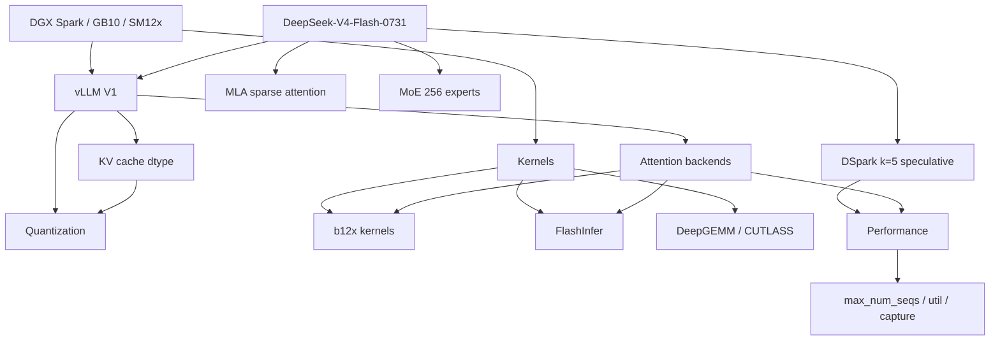

# DeepSeek-V4-Flash-0731 on 2× DGX Spark — Knowledge Base

**A definitive, cross-linked knowledge corpus for serving `deepseek-ai/DeepSeek-V4-Flash-0731` on two NVIDIA DGX Spark (GB10, SM12x/sm_121a) nodes over RoCE.**

> **Sources:** This repo (`vllm-spark-0731`), the raw archives of its
> predecessor repos in [`docs/field-notes/`](../field-notes/README.md)
> (`maci0/dgx-spark-deepseek-v4-flash-0731` field notes, `vllm-spark-nvfp4`),
> the `vllm-spark-main-b12x` lineage, and an external DGX Spark lab corpus
> (distilled into chapters 01, 05, 06, 07, 10, 11), plus upstream
> vLLM/FlashInfer/b12x/DeepGEMM.

---

## Quick Links

| Topic | Document |
|-------|----------|
| **Architecture & Codebase Audit** | [outputs/vllm-spark-0731-docs-audit.md](../../outputs/vllm-spark-0731-docs-audit.md) — Canonical Audit Artifact ([Plan](../../outputs/.plans/vllm-spark-0731-docs.md)) |
| **Hardware & Cluster** | [01-hardware.md](01-hardware.md) — GB10, SM12x, UMA, RoCE fabric |
| **Model Architecture** | [02-model.md](02-model.md) — DSV4, MLA, MoE 256 experts, DSpark k=5 |
| **Kernel Stack & Attention** | [03-kernels-attention.md](03-kernels-attention.md) — b12x vs FlashInfer, SM12x gaps, NVFP4 blockscaled GEMM (Colfax) |
| **Quantization & KV Cache** | [04-quantization-kv.md](04-quantization-kv.md) — FP8/MXFP4/NVFP4, 584 B envelope |
| **Performance** | [05-performance.md](05-performance.md) — Benchmarks, levers, root causes |
| **Deployment & Images** | [06-deployment.md](06-deployment.md) — Lineages, config, build, run |
| **Gotchas & Constraints** | [07-gotchas.md](07-gotchas.md) — The "do not" list (hard-learned) |
| **Upstream Gaps & PRs** | [08-upstream.md](08-upstream.md) — What's open/merged/missing upstream |
| **Golden image analysis** | [09-golden-deepgemm.md](09-golden-deepgemm.md) — Exact speed difference + DeepGEMM lift plan |
| **Agent ops & failure recovery** | [10-operations-agents.md](10-operations-agents.md) — Endpoint contract, brain/worker split, runbook |
| **Cost & vendor decision** | [11-cost-decision.md](11-cost-decision.md) — CAPEX/OPEX/TCO, GPT-5.6 Sol vs local, GB10 OEM choice |
| **Debug stand-in & tiny V4** | [12-debug-standin.md](12-debug-standin.md) — Shallowseek, exact config ground truth, differential-test workflow |
| **Architecture transplant** | [13-qwenseek.md](13-qwenseek.md) — Qwen MoE trunk → V4 attention, measured MTP-3 finding, transfer ledger |
| **Golden setup (reference target)** | [14-golden-setup.md](14-golden-setup.md) — anemll image: exact config, why 2× faster, how to reproduce, measured numbers |
| **Raw evidence & field notes** | [docs/field-notes/README.md](../field-notes/README.md) — per-chapter mapping to the unedited source documents |
| **Knowledge Graph** | [graph.md](graph.md) — document graph (generated), concept graph, entity index |
| **Glossary** | [glossary.md](glossary.md) — shared vocabulary (b12x, DSV4, mHC, eidx, nv_dev, …) |

---

## One-Paragraph Summary

The model runs with **b12x kernels** for linear/MoE/attention and a custom **`B12X_MLA_SPARSE`** attention backend on the **584-byte DSV4 MLA page**, **DSpark k=5** speculative decoding, and **`nvfp4_ds_mla`** KV cache. On SM12x (Blackwell), DeepGEMM TMA attention routines and CUTLASS block-FP8 don't run natively (SM90/SM100 only), so several ops fall back to PyTorch/TileLang/b12x. Aggregate throughput is gated by `max_num_seqs` (raised 8→32: ~88→~172 tok/s @ c32); the ~2× gap to the golden (anemll) image is **whole-stack** (older vLLM core + their kernels + real NVFP4 writer), not the attention backend (our A/B showed backend parity). **Max speed + real NVFP4 KV = the golden image**: deployed 2026-08-24, France c1 **65.2** / c6 **216.8** tok/s, KV **2.05M** tokens @ 7,650 B/token.

---

## Knowledge Graph

Concept map (how the entities relate). The **document graph** — chapters as
nodes, edges derived from the real footers / Related Docs / Raw evidence
links — plus an entity index live in **[graph.md](graph.md)** (generated by
`scripts/knowledge-graph.py`).



---

## Image Lineage (Current State: 2026-08-24)

| Image | Base | vLLM | Python | Key Features |
|-------|------|------|--------|--------------|
| `vllm-spark-0731:main-b12x` | `nvidia/cuda:13.3.1-cudnn-devel-ubuntu24.04` | **matched main** (`e25c586b9`) | source torch 2.14 (12.1a) | b12x linear+MoE+attn, `nvfp4_ds_mla`, `B12X_MLA_SPARSE`, InstantTensor, util 0.8 |
| `vllm-spark-0731:v0.28.0rc2-b12x` | `vllm/vllm-openai:v0.27.1` (arm64) | v0.28.0rc2 (`74a6576`) + overlays | pip torch | b12x linear+MoE, `nvfp4_ds_mla` or `fp8_ds_mla`, `FLASHINFER_MLA_SPARSE_DSV4`, fallback |

**Live (2026-08-24 08:13 UTC):** `vllm-spark-0731:main-b12x` — matched vLLM `v0.1.dev1+ge25c586b9.d20260823`, CUDA 13.3.1, torch 2.14 `12.1a`. b12x linear + MoE + `B12X_MLA_SPARSE` (target and DSpark draft), `nvfp4_ds_mla` 584 B DSV4 envelope, DSpark k=5, `FULL_AND_PIECEWISE`, DSpark backbone FULL (sample eager), util **0.8**, TP=2 over RoCE.

---

## Quality Gate (Do Not Weaken)

```bash
# Greedy "The capital of France is" (temperature=0, max_tokens=32)
# Must produce coherent English. Proven string:
# " Paris. The capital of Spain is Madrid. The capital of Italy is Rome. ..."
# First token ' Paris' logprob ~ -0.24 to -0.27, n_tie=1. Chat answers "Paris."

VALIDATE_STACK=main ./scripts/06-validate.sh
```

---

## Critical Pins (From `configs/pin.main.env`)

| Component | Pin |
|-----------|-----|
| **Base** | `nvidia/cuda:13.3.1-cudnn-devel-ubuntu24.04` |
| **PyTorch** | `release/2.14` from source, `TORCH_CUDA_ARCH_LIST=12.1a` |
| **NCCL** | source, `sm_121` |
| **vLLM** | git `main`, `--no-build-isolation` |
| **FlashInfer** | git `main` (DSV4 TOPK 192) |
| **b12x** | git master + **cutlass-dsl 4.7.0** metadata rewrite |
| **DeepGEMM** | `nv_dev` commit `a6b593d` (pinned back 2026-08-25 — `8b1392b` regressed SM12x fp8 linear; see [09](09-golden-deepgemm.md)) |
| **Load** | InstantTensor + hybrid lazy safetensors for DSpark draft |
| **KV** | `nvfp4_ds_mla` (584 B DSV4 envelope, **not** GLM 432/368) |
| **Linear / MoE** | `--linear-backend b12x`, `--moe-backend b12x` |
| **Attention** | `B12X_MLA_SPARSE` (registered via `patches/files/dsv4_b12x_sparse.py`) |
| **Spec** | DSpark k=5. Backbone FULL, sample eager. |
| **Graphs** | PIECEWISE 11/11 + FULL 7/7. TP AR in-graph. |
| **Util** | **0.8** (swap now enabled; 0.85 still dies on earlyoom 8% + decode stalls) |

---

## How to Use This Knowledge Base

1. **Start here** — This index links to all topics. Every chapter opens with a one-line **Scope**.
2. **Read in order 01 → 13 for a guided tour** — Chapters build on each other; each ends with a *Next →* link. Keep the [glossary](glossary.md) at hand for vocabulary.
3. **Pick a reading path** — the corpus supports three journeys:
   - *New to the stack:* 01 → 02 → 03 → 04 → 05 → 06 (hardware → model → kernels → KV → performance → deployment)
   - *Debugging / operating:* 07 (do-not list) → 10 (agents + runbook) → 09 (the DeepGEMM regression), with 05 for numbers
   - *Benchmarking / buying:* 05 (methodology + measured) → 09 (golden comparison) → 11 (TCO / Sol / vendor)
4. **Follow cross-references** — Documents link to each other extensively; [graph.md](graph.md) shows the whole map.
5. **Drill into raw evidence** — Each chapter ends with *Raw evidence* links into [docs/field-notes/](../field-notes/README.md)
6. **Check timestamps** — Some sections note "as of 2026-08-24"; verify if stale
7. **Contribute** — Found a gap? Add to the relevant doc and update this index

---

## Raw Archives & Reference Corpora

The unedited source documents of the two predecessor GitHub repos live in
**[`docs/field-notes/`](../field-notes/README.md)** — `nvfp4/`
(vllm-spark-nvfp4: NVFP4 MLA KV patch write-ups, DeepGEMM call-site gaps, KV
offload root cause) and `dgx-spark/` (field notes: full sweep, golden recipe,
KV ceiling, tuning, troubleshooting, session/test logs). The older
`vllm-spark-main-b12x` repo was already fully contained here.

## Related External Resources

- [vLLM Documentation](https://docs.vllm.ai) — Core serving engine
- [b12x GitHub](https://github.com/local-inference-lab/b12x) — SM120/121 kernel library
- [FlashInfer GitHub](https://github.com/flashinfer-ai/flashinfer) — Attention/GEMM/MoE kernels
- [DeepGEMM GitHub](https://github.com/deepseek-ai/DeepGEMM) — FP8/FP4/BF16 GEMM, MoE, MQA
- [DeepEP GitHub](https://github.com/deepseek-ai/DeepEP) — Expert-parallel communication
- [DeepSeek-V4-Flash-0731 HF](https://huggingface.co/deepseek-ai/DeepSeek-V4-Flash-0731) — Model card & config
- [NVIDIA DGX Spark](https://www.nvidia.com/en-us/data-center/dgx-spark/) — Hardware platform