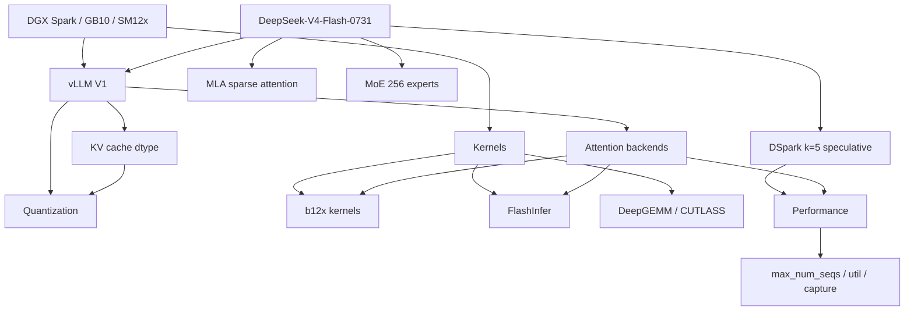

# DeepSeek-V4-Flash-0731 on 2× DGX Spark — Knowledge Base

> **Start here:** [00-index.md](00-index.md) — The main entry point with quick links and summary.

---

## Legacy README (Kept for Reference)

A linked knowledge corpus for serving `deepseek-ai/DeepSeek-V4-Flash-0731` on two NVIDIA DGX Spark (GB10, SM12x/sm_121a) nodes over RoCE.

Sources: `maci0/dgx-spark-deepseek-v4-flash-0731` (field notes), this repo (`vllm-spark-0731`), and `vllm-spark-main-b12x`.

## Knowledge Graph

## Topics (New Structure)

| # | Topic | Document |
|---|-------|----------|
| 0 | **Index & Quick Start** | [00-index.md](00-index.md) |
| 1 | Hardware | [01-hardware.md](01-hardware.md) |
| 2 | Model | [02-model.md](02-model.md) |
| 3 | Kernel Stack & Attention | [03-kernels-attention.md](03-kernels-attention.md) |
| 4 | Quantization & KV Cache | [04-quantization-kv.md](04-quantization-kv.md) |
| 5 | Performance | [05-performance.md](05-performance.md) |
| 6 | Deployment & Images | [06-deployment.md](06-deployment.md) |
| 7 | Gotchas & Constraints | [07-gotchas.md](07-gotchas.md) |
| 8 | Upstream Gaps & PRs | [08-upstream.md](08-upstream.md) |
| 9 | Golden image analysis | [09-golden-deepgemm.md](09-golden-deepgemm.md) |
| — | **Architecture & Codebase Audit** | [vllm-spark-0731-docs-audit.md](../../outputs/vllm-spark-0731-docs-audit.md) |

## One-Paragraph Summary

The model runs with b12x kernels for linear/MoE/attention and a custom `B12X_MLA_SPARSE` attention backend on the 584-byte DSV4 MLA page, DSpark k=5 speculative decoding, and `nvfp4_ds_mla` KV. On SM12x (Blackwell), DeepGEMM TMA attention routines and CUTLASS block-FP8 don't run natively (SM90/SM100 only), so several ops fall back to PyTorch/TileLang/b12x. Aggregate throughput is gated by `max_num_seqs` (raised 8→32: ~88→~172 tok/s @ c32). The ~2× gap to the anemll/eugr images is **whole-stack** (their older vLLM cores + kernels + the real NVFP4 writer), not the attention backend — our own A/B showed `FLASHINFER_MLA_SPARSE_DSV4` ≈ `B12X_MLA_SPARSE` (parity at c32: 179 vs 172 tok/s).

## Sources

Primary sources this corpus is built from:

| Source | What it contributes |
|--------|---------------------|
| [`docs/field-notes/dgx-spark/`](../field-notes/dgx-spark/README.md) (merged from `maci0/dgx-spark-deepseek-v4-flash-0731`, deleted) | Field notes / writeups: `GOLDEN.md` (anemll recipe + measured numbers), `KV_CEILING.md`, `PROD_C5_SSD.md` (offload), `EUGR_B12X_PROD.md`, `TUNING.md`, `TROUBLESHOOTING.md` |
| [`docs/field-notes/nvfp4/`](../field-notes/nvfp4/README.md) (merged from `maci0/vllm-spark-nvfp4`, deleted) | NVFP4 lineage: `EUGR_NVFP4.md` (the 432/584 mismatch), `KV_OFFLOAD_MLA.md` (offload flat-layout root cause) |
| `vllm-spark-main-b12x` (deleted; already fully contained here) | Matched-main build (CUDA 13.3.1, source torch 2.14 12.1a) |
| this repo (`vllm-spark-0731`) | Overlays, backport patches, measurements, HANDOFF |
| [tonyd2wild recipe repo](https://github.com/tonyd2wild) | stage-c DSpark-NVFP4 recipe (584 B envelope, not real NVFP4) |
| [vllm-project/vllm](https://github.com/vllm-project/vllm) PRs #53055/#53425/#53521/#53522/#53574/#47988 + issue #53607 | Upstream gap tracking (see 08-upstream.md) |
| [eugr/spark-vllm-docker](https://github.com/eugr/spark-vllm-docker) | eugr lineage (b12x kernels, nv_dev DeepGEMM pin) |
| [anemll](https://github.com/anemll) `dspark-vllm-gx10:0.1.1` | Golden image: the only real-NVFP4 writer measured on this cluster |