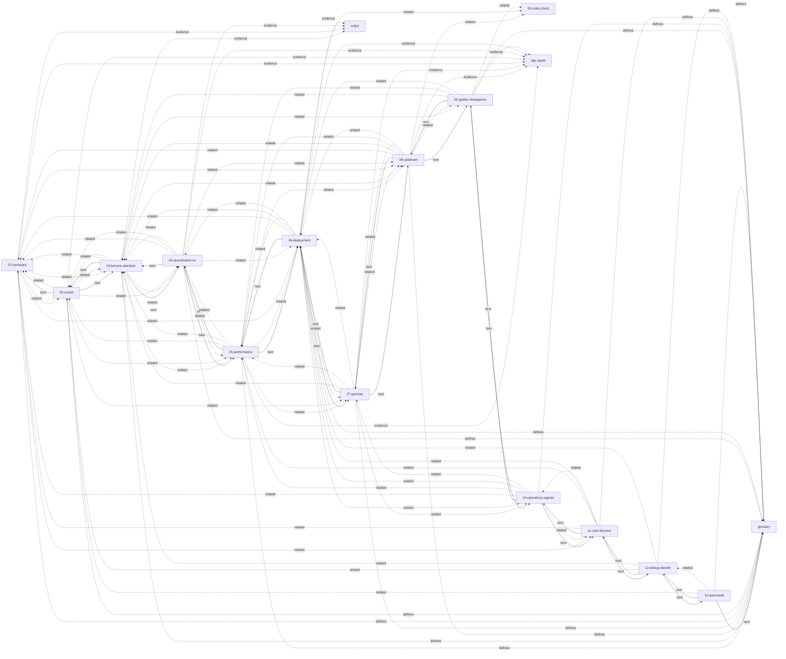
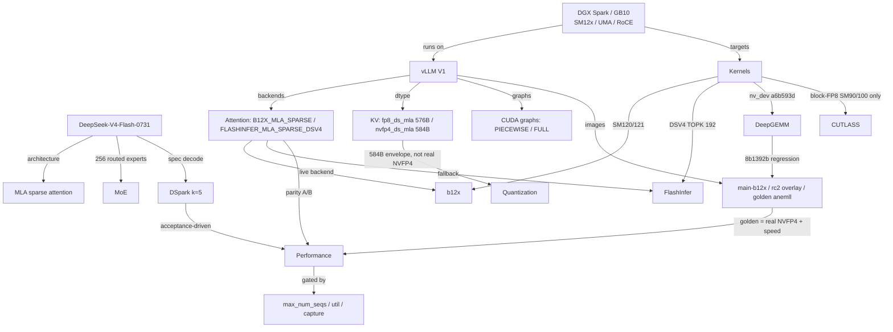

[← Index](00-index.md) · [Glossary](glossary.md)

# Knowledge Graph

The corpus as a graph, in three layers: the **document graph** (how the pages
connect — generated from the real links), the **concept graph** (how the
entities relate), and an **entity index** (term → chapter). Kept in one place
so the corpus stays navigable as it grows.

## Legend

| Edge | Meaning |
|------|---------|
| `next` (solid) | footer reading chain — read in this order for a guided tour |
| `related` (dotted) | `## Related Docs` cross-reference between chapters |
| `defines` (dotted) | chapter links to the glossary for vocabulary |
| `evidence` (dotted) | chapter's `Raw evidence` links into `docs/field-notes/` |

## Document graph

Generated, not hand-maintained — re-run `python3 scripts/knowledge-graph.py`
after any chapter edit (it parses the footers, Related Docs, Raw evidence and
top-nav links).

**Reading spine** (the footer chain — follow it for a guided tour):

```mermaid
graph LR
  00-index["00-index (hub)"]
  01-hardware["01-hardware"]
  02-model["02-model"]
  03-kernels-attention["03-kernels-attention"]
  04-quantization-kv["04-quantization-kv"]
  05-performance["05-performance"]
  06-deployment["06-deployment"]
  07-gotchas["07-gotchas"]
  08-upstream["08-upstream"]
  09-golden-deepgemm["09-golden-deepgemm"]
  10-operations-agents["10-operations-agents"]
  11-cost-decision["11-cost-decision"]
  12-debug-standin["12-debug-standin"]
  13-qwenseek["13-qwenseek"]
  glossary["glossary"]
  05-performance --> 04-quantization-kv
  05-performance --> 06-deployment
  03-kernels-attention --> 02-model
  03-kernels-attention --> 04-quantization-kv
  08-upstream --> 07-gotchas
  08-upstream --> 09-golden-deepgemm
  07-gotchas --> 06-deployment
  07-gotchas --> 08-upstream
  02-model --> 01-hardware
  02-model --> 03-kernels-attention
  04-quantization-kv --> 03-kernels-attention
  04-quantization-kv --> 05-performance
  06-deployment --> 05-performance
  06-deployment --> 07-gotchas
  09-golden-deepgemm --> 08-upstream
  09-golden-deepgemm --> 10-operations-agents
  10-operations-agents --> 09-golden-deepgemm
  10-operations-agents --> 11-cost-decision
  11-cost-decision --> 10-operations-agents
  11-cost-decision --> 12-debug-standin
  12-debug-standin --> 11-cost-decision
  12-debug-standin --> 13-qwenseek
  13-qwenseek --> 12-debug-standin
  13-qwenseek --> glossary
```



**Full graph** (all edge types):



**Edge list** (text form, for search/accessibility):

<details>
<summary>show 118 edge lines</summary>

```
[next] 24
  02-model -> 01-hardware
  02-model -> 03-kernels-attention
  03-kernels-attention -> 02-model
  03-kernels-attention -> 04-quantization-kv
  04-quantization-kv -> 03-kernels-attention
  04-quantization-kv -> 05-performance
  05-performance -> 04-quantization-kv
  05-performance -> 06-deployment
  06-deployment -> 05-performance
  06-deployment -> 07-gotchas
  07-gotchas -> 06-deployment
  07-gotchas -> 08-upstream
  08-upstream -> 07-gotchas
  08-upstream -> 09-golden-deepgemm
  09-golden-deepgemm -> 08-upstream
  09-golden-deepgemm -> 10-operations-agents
  10-operations-agents -> 09-golden-deepgemm
  10-operations-agents -> 11-cost-decision
  11-cost-decision -> 10-operations-agents
  11-cost-decision -> 12-debug-standin
  12-debug-standin -> 11-cost-decision
  12-debug-standin -> 13-qwenseek
  13-qwenseek -> 12-debug-standin
  13-qwenseek -> glossary
[related] 65
  01-hardware -> 02-model
  01-hardware -> 03-kernels-attention
  01-hardware -> 06-deployment
  01-hardware -> 08-upstream
  01-hardware -> 11-cost-decision
  02-model -> 01-hardware
  02-model -> 03-kernels-attention
  02-model -> 04-quantization-kv
  02-model -> 05-performance
  02-model -> 07-gotchas
  03-kernels-attention -> 01-hardware
  03-kernels-attention -> 02-model
  03-kernels-attention -> 04-quantization-kv
  03-kernels-attention -> 05-performance
  03-kernels-attention -> 08-upstream
  03-kernels-attention -> 09-golden-deepgemm
  04-quantization-kv -> 01-hardware
  04-quantization-kv -> 02-model
  04-quantization-kv -> 03-kernels-attention
  04-quantization-kv -> 05-performance
  04-quantization-kv -> 06-deployment
  04-quantization-kv -> 08-upstream
  05-performance -> 02-model
  05-performance -> 03-kernels-attention
  05-performance -> 04-quantization-kv
  05-performance -> 06-deployment
  05-performance -> 07-gotchas
  05-performance -> 08-upstream
  06-deployment -> 00-index
  06-deployment -> 01-hardware
  06-deployment -> 03-kernels-attention
  06-deployment -> 04-quantization-kv
  06-deployment -> 05-performance
  06-deployment -> 07-gotchas
  06-deployment -> 10-operations-agents
  07-gotchas -> 03-kernels-attention
  07-gotchas -> 05-performance
  07-gotchas -> 06-deployment
  07-gotchas -> 08-upstream
  07-gotchas -> 10-operations-agents
  08-upstream -> 00-index
  08-upstream -> 01-hardware
  08-upstream -> 03-kernels-attention
  08-upstream -> 05-performance
  08-upstream -> 06-deployment
  08-upstream -> 07-gotchas
  08-upstream -> 09-golden-deepgemm
  09-golden-deepgemm -> 00-index
  09-golden-deepgemm -> 03-kernels-attention
  09-golden-deepgemm -> 05-performance
  09-golden-deepgemm -> 06-deployment
  10-operations-agents -> 01-hardware
  10-operations-agents -> 05-performance
  10-operations-agents -> 06-deployment
  10-operations-agents -> 07-gotchas
  10-operations-agents -> 11-cost-decision
  11-cost-decision -> 01-hardware
  11-cost-decision -> 05-performance
  11-cost-decision -> 06-deployment
  11-cost-decision -> 10-operations-agents
  12-debug-standin -> 02-model
  12-debug-standin -> 03-kernels-attention
  12-debug-standin -> 06-deployment
  13-qwenseek -> 02-model
  13-qwenseek -> 12-debug-standin
[defines] 13
  01-hardware -> glossary
  02-model -> glossary
  03-kernels-attention -> glossary
  04-quantization-kv -> glossary
  05-performance -> glossary
  06-deployment -> glossary
  07-gotchas -> glossary
  08-upstream -> glossary
  09-golden-deepgemm -> glossary
  10-operations-agents -> glossary
  11-cost-decision -> glossary
  12-debug-standin -> glossary
  13-qwenseek -> glossary
[evidence] 12
  01-hardware -> dgx-spark
  01-hardware -> nvfp4
  02-model -> dgx-spark
  03-kernels-attention -> nvfp4
  04-quantization-kv -> dgx-spark
  04-quantization-kv -> nvfp4
  05-performance -> dgx-spark
  06-deployment -> dgx-spark
  06-deployment -> nvfp4
  07-gotchas -> dgx-spark
  08-upstream -> dgx-spark
  09-golden-deepgemm -> dgx-spark
```

</details>

## Concept graph

Hand-authored; update when the entity set changes. Entities are the nouns the
chapters are about; edges are typed relationships.



## Entity index

| Entity | Kind | Covered in | Glossary |
|--------|------|-----------|----------|
| DGX Spark / GB10 / SM12x / UMA / RoCE | hardware | [01-hardware](01-hardware.md) | ✓ |
| DeepSeek-V4-Flash-0731 | model | [02-model](02-model.md) | — |
| MLA, MoE, DSpark, MTP | model architecture | [02-model](02-model.md) | ✓ (MLA/MoE/DSpark/MTP) |
| b12x, FlashInfer, DeepGEMM, CUTLASS | kernels | [03-kernels-attention](03-kernels-attention.md) | ✓ |
| fp8_ds_mla / nvfp4_ds_mla / 584 B envelope | KV dtype | [04-quantization-kv](04-quantization-kv.md) | ✓ |
| max_num_seqs / util / capture | levers | [05-performance](05-performance.md) | ✓ (util) |
| main-b12x / rc2 overlay / golden images | deployments | [06-deployment](06-deployment.md) | — |
| do-not list, failure modes | constraints | [07-gotchas](07-gotchas.md) | — |
| upstream PRs, DeepGEMM pins | upstream | [08-upstream](08-upstream.md), [docs/UPSTREAM.md](../UPSTREAM.md) | — |
| DeepGEMM regression, pin-back | deep dive | [09-golden-deepgemm](09-golden-deepgemm.md) | ✓ (nv_dev) |
| endpoint contract, agents, runbook | operations | [10-operations-agents](10-operations-agents.md) | ✓ (EXL3, SparkInfer) |
| TCO, Sol, vendor choice | decision | [11-cost-decision](11-cost-decision.md) | ✓ (GPT-5.6 Sol) |

## Maintenance

- **Document graph**: regenerate (`scripts/knowledge-graph.py`) whenever
  chapters change — it validates the reading chain and Related Docs symmetry
  at the same time.
- **Concept graph / entity index**: update when the entity set or the chapter
  map changes (e.g. a new model, backend, or chapter).
- The `verify-docs.py` harness keeps links and refs valid; the graph adds the
  navigational layer on top.

---

**[← Index](00-index.md) · [Glossary](glossary.md) · [Top](#)**
